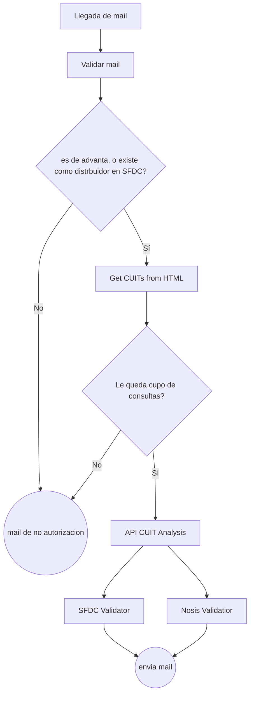

## Intro
El bot de créditos usa varios flujos. Los flujos se comunican entre si a través de APIs. 

## Flujo de flujos (vale la redundancia)
Aca dejo una descripción de como los flujos se van llamando entre si. Mantuve los nombres de los flujos originales en el cuadro(omitiendo version y comentario ej: `Llegada de mail`). Todos los flujos son los que están en rectángulos, el resto son eventos o decisiones (estos suceden dentro de los flujos) . 

:::note
Realmente nunca se sale del flujo original, los demás flujos se llaman dentro del flujo principal `Llegada de mail` y devuelven datos a este flujo que luego arma el email de salida. 
:::