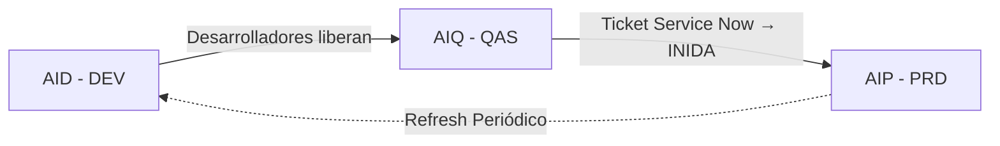

# Introducción

Bienvenido a la documentación técnica de **SAP** de nuestra organización. Esta documentación esta hecha en base a la Compañía 5490.  

:::note
Es importante aclarar que el objetivo de esta documentación no es explicar transacciones estándar de SAP, ya que esto puede encontrarse dentro de la documentación oficial de SAP. El objetivo de esta documentación es: 
* Explicar transacciones y procesos Custom.
* Definir y estandarizar procesos y formas de operar.
:::

## Estructura de la Documentación

### Por Módulos SAP
La documentación está organizada por módulos funcionales:
- **[Finance](/category/finance)**  - Contabilidad Financiera
- **Controlling** - Controlling
- **Material Managment** - Gestión de Materiales
- **[Sales and Distribution](/category/sales-and-distribution)** - Ventas y Distribución

### Por Procesos de Negocio
También encontrarás documentación por procesos integrales:
- Orden a Cobro (Order to Cash)
- Adquirir a Pagar (Procure to Pay)
- Registrar a Reportar (Record to Report)

## Primeros Pasos

### Arquitectura de Sistemas SAP

En Advanta International, operamos con una estructura estándar de tres ambientes SAP:

#### 🟢 **AIP - Producción**
- **Servidor**: ``
- **Propósito**: Ambiente operativo real donde se ejecutan todos los procesos de negocio
- **Uso**: Exclusivo para transacciones productivas del día a día
- **Características**: 
  - Datos reales de clientes, proveedores y operaciones
  - Acceso restringido según roles específicos

#### 🟡 **AIQ - Calidad**
- **Servidor**: ``
- **Propósito**: Ambiente de testing y validación antes de pasar a producción
- **Uso**: 
  - Pruebas de nuevos desarrollos
  - Validación de configuraciones
  - Training de usuarios
- **Características**:
  - Copia periódica de datos de producción
  - Entorno seguro para experimentación

#### 🔵 **AID - Desarrollo**
- **Servidor**: ``
- **Propósito**: Ambiente para desarrollo y customizaciones
- **Uso**:
  - Programación de nuevos reports
  - Creación de enhancements
  - Configuraciones iniciales
- **Características**:
  - Datos de prueba
  - Acceso para consultores y desarrolladores

### Flujo de Cambios y Transportes

El movimiento de cambios entre ambientes se realiza mediante **Órdenes de Transporte** de SAP, siguiendo un proceso controlado:

#### Proceso de Transporte

#### Pasos Detallados:

1. **Desarrollo → Calidad (AID → AIQ)**
   - Los desarrolladores liberan las órdenes de transporte
   - Movimiento automático al ambiente de calidad

2. **Calidad → Producción (AIQ → AIP)**
   - **Requiere ticket en Service Now** con:
     - Números de orden de transporte
     - Detalle completo de testing realizado
     - Evidencias de pruebas exitosas
     - Impacto/descripción de los cambios
   - El equipo de **INIDA** ejecuta el transporte a producción

#### Información Requerida en Service Now:
- ✅ **Números de transporte**: Incluir todas las órdenes relacionadas
- ✅ **Resumen de cambios**: Qué se modifica/agrega/elimina
- ✅ **Evidencias de testing**: Capturas, logs, resultados
- ✅ **Horario planeado**: Ventana de cambio solicitada

