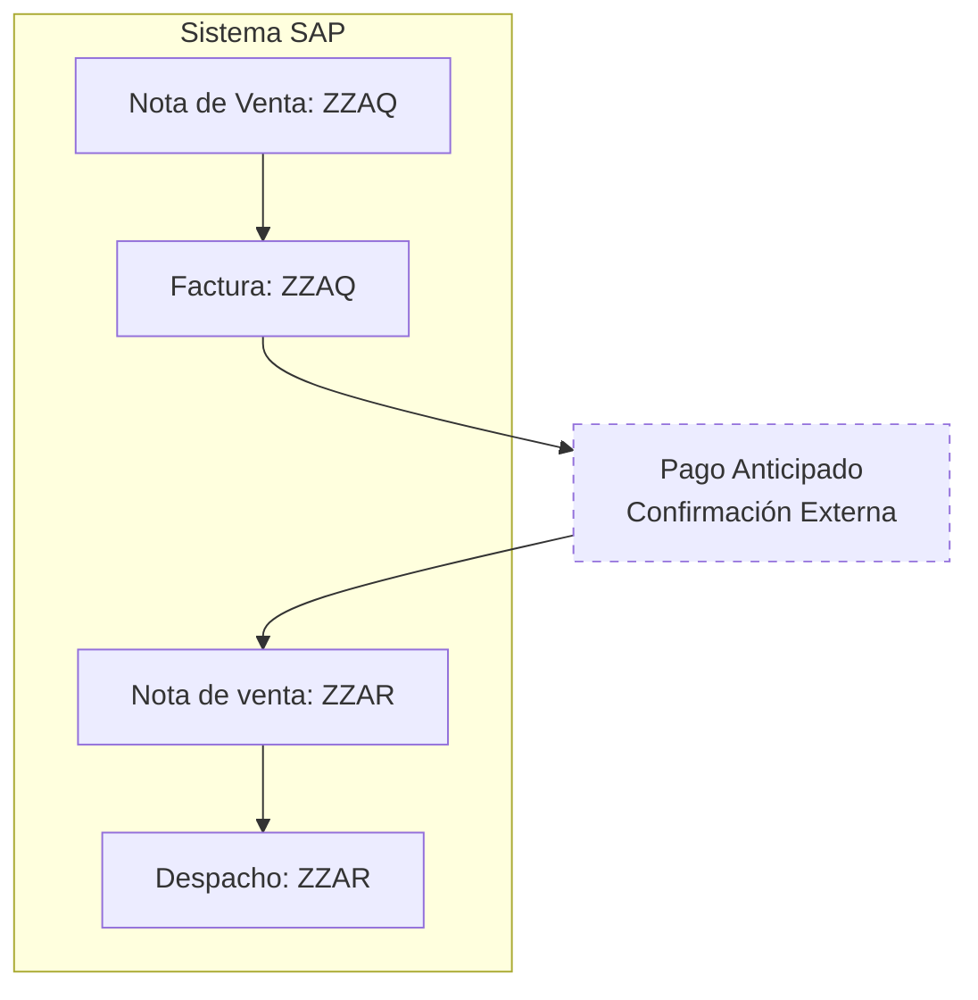

Los anticipos son un tipo de venta en la cual **se realiza la facturación antes del despacho** de la mercadería. 

:::note
En estos casos, el documento que se facturan en SAP son directamente la **nota de venta**, en lugar de facturar un delivery u OBD (Orden de Entrega).
:::

## Flujo del Proceso

### Descripción

El circuito del documento **ZZAQ** sigue estos pasos:
1. **Nota de venta ZZAQ** → Se crea como documento principal para el anticipo
2. **Factura ZZAQ** → Se factura directamente desde la nota de venta ZZAQ
3. **Pago anticipado** → El cliente paga la factura antes del despacho
4. **Nota de venta ZZAR** → Se crea para gestionar el despacho de la mercadería
5. **Despacho de ZZAR** → Se realiza el despacho físico de la mercadería

**Punto clave**: A diferencia de las ventas normales donde se factura el despacho (OBD), en los anticipos se factura directamente la nota de venta (ZZAQ) porque el pago ocurre antes de la preparación y envío de la mercadería. Posteriormente, el despacho se gestiona mediante una nota de venta diferente (ZZAR).

