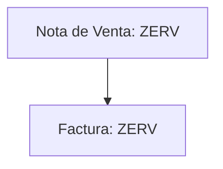

Para la facturación de servicios, el sistema utiliza notas de venta de tipo **`ZERV`**, diseñadas específicamente para este propósito.

::::tip
Para este tipo de notas de venta se utiliza el material especifico ?????
::::

## Flujo del Proceso

### Características del Proceso

- **Facturación directa**: Las notas de venta se facturan directamente sin procesos intermedios.
- **Sin gestión de inventario**: Al tratarse de servicios, no se requiere control de stock ni despacho de mercaderías.
- **Proceso simplificado**: Flujo ágil y eficiente para la facturación de servicios.