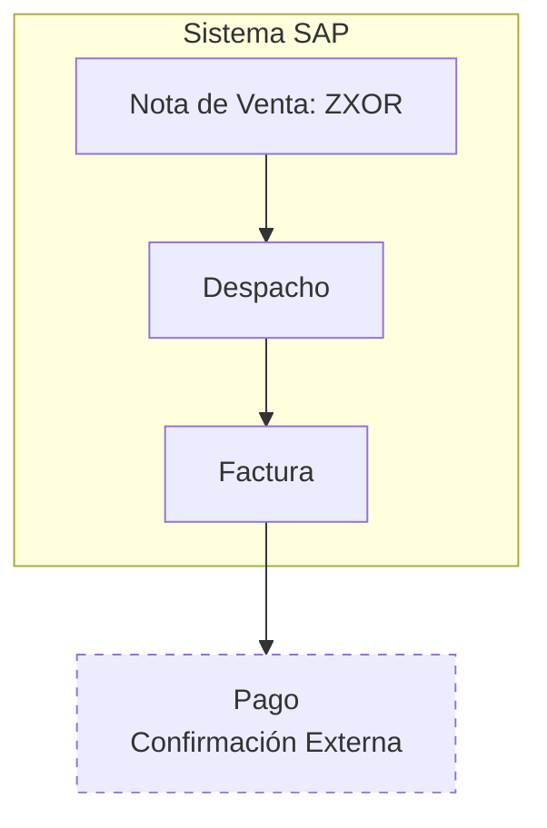

## Flujo del Proceso de Venta



### Descripción

1. **Nota de Venta (ZXOR)**: Inicio del proceso de venta en el sistema SAP
2. **Despacho**: Procesamiento y preparación del pedido
3. **Factura**: Generación del documento fiscal
4. **Pago**: Confirmación externa del pago (fuera del sistema SAP)

### Características
- Proceso integrado dentro del sistema SAP
- El pago se gestiona externamente al sistema
- Flujo secuencial estándar para ventas con despacho físico
```

## Principales mejoras:

1. **Título más descriptivo**: "Proceso de Venta" en lugar de solo "Venta"
2. **Estructura organizada**: Secciones claras con descripción paso a paso
3. **Explicación del flujo**: Detalle de cada etapa del proceso
4. **Características destacadas**: Puntos clave del proceso
5. **Formato profesional**: Mantiene el diagrama pero con mejor contexto

¿Te parece adecuada esta versión o necesitas ajustar algún aspecto?