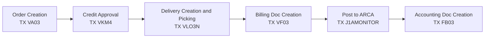

El proceso mas común de ventas simplificado sigue el siguiente flujo.

Sin embargo hay algunas excepciones son: 
- [Anticipos](/sales-and-distribution/Procesos/anticipo)
- [Servicios](/sales-and-distribution/Procesos/servicio)
- [Consignaciones](/sales-and-distribution/Procesos/consignacion)